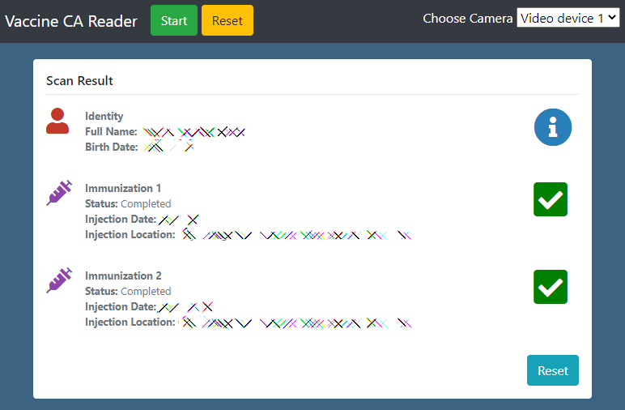

# Vaccine CA Reader

# Overview
This will allow to check someone immunization using their California QR Code for any valid reason. Using fproulx's original code, I have wrapped this into something more user friendly with only the necessary data.

It should be compatible with the Smart Health Card standard used by Quebec and the state of California.

# Usage
- **Hosted version**: https://www.mkpascal.net/vaccine-ca-reader/
- (or) **Deploy/Copy** and start with **index.html**.

# Building
- JS Compilation: `npm run build`

# Disclaimer
This is just a **wrapper** over the **original code** by [fproulx](https://github.com/fproulx/shc-covid19-decoder) who did the original work to decode QR code using the SHC standard. I do not take any responsibility and I'm not liable for anything caused through the use of this code. This is just something personal I've made in my free time outside work time. This is only for experimental and entertainment usage.

Everything is done client-side. None of your data is stored. No data is transmitted to any server. This includes the hosted version and/or if you download the code.

Also, more details about the vaccine record by the EFF: https://www.eff.org/deeplinks/2021/06/decoding-californias-new-digital-vaccine-records-and-potential-dangers

# Credits
- Original Code: https://github.com/fproulx/shc-covid19-decoder
- CA SHC Fix: https://github.com/thardie/shc-covid19-decoder
- Bootstrap & jQuery